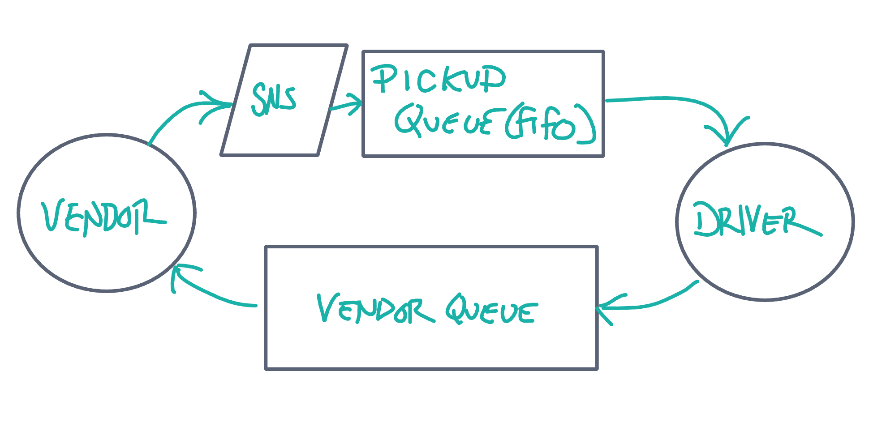

# CAPS Cloud

An event driven serverless messaging system designed to facilitate messages between multiple vendor and driver clients in a delivery network using AWS SNS and SQS.

## Installation

1. Clone this repository onto your local machine
2. `cd` into `./CAPS-cloud`
3. Install package dependencies with `npm install`

## Author

Micha Davis
